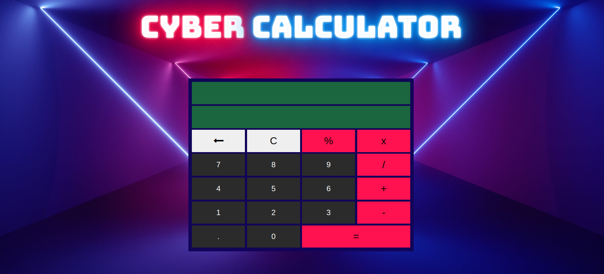

# Cyber-Calculator

> Cyber-Calculator is a fully responsive calculator website with a cyber theme

## Table of contents

- [Overview](#overview)
  - [Features](#features)
  - [Screenshot](#screenshot)
  - [Links](#links)
- [My process](#my-process)
  - [Built with](#built-with)
- [Author](#author)

## Overview

### Features

- [x] No use of eval() function
- [x] You can add, subtract, multiply, divide and modulo operations
- [x] Delete something in the middle of calculation and change the numbers
- [x] Calculate with the results of the previous calculation
- [x] Calculations with decimals
- [x] Fully responsive and mobile friendly

### Screenshot

### Links

> View the project [here](https://funkosaur.github.io/calculator/)

## My process

### Built with

- HTML5
- CSS
- Flexbox
- CSS Grid
- Desktop-first workflow
- Javascript

## Author

- Website - [Mario Boykovski](https://github.com/funkosaur)
